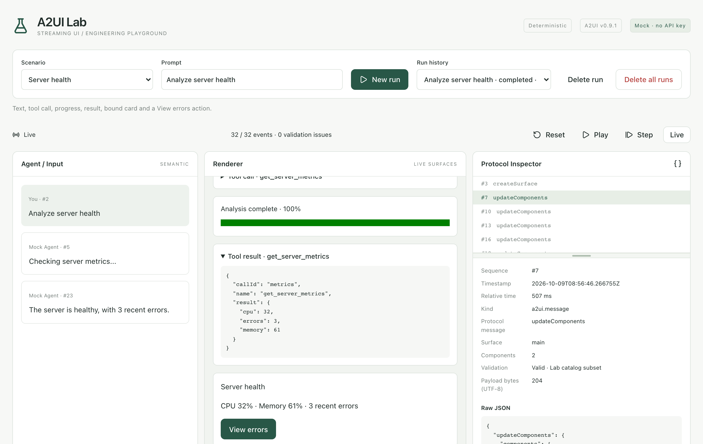

# A2UI Lab

[English](README.md) | [简体中文](README_zh.md)

A local engineering playground for streaming Agent UIs: run deterministic scenarios, inspect semantic and protocol events, interact with generated surfaces, and replay persisted runs without calling an LLM.

---

## Features

- **Zero-Config & Standalone**: Pure Go single binary embedding React assets and goose SQLite migrations. Runs instantly without external API keys, accounts, or cloud dependencies.
- **Deterministic Scenario Ladder**: 7 built-in progressive scenarios covering streaming text, tool calling, rich media, and human-in-the-loop approvals.
- **End-to-End Protocol Observability**: Protocol Inspector and Timeline provide real-time inspection of raw JSON envelopes, component hierarchies, data model bindings, and sequential events.
- **Event-Sourced Deterministic Replay**: Every UI state is fully explainable by a persisted event prefix. Step, Reset, and Play reconstruct state entirely offline without LLM invocations.
- **Secure Sandboxed Interaction**: Controlled rendering guarantees incoming code/HTML is never dynamically executed. Human-in-the-loop forms and approvals persist cleanly across restarts in `waiting_input`.

---

## Quick Start

### 1. Launch in Development

```sh
make install
make dev
# Open http://localhost:5173 — no account, API key or external service needed.
```

### 2. Basic Walkthrough



1. **Select a Scenario**: Choose a scenario from the dropdown (e.g. **Server health**).
2. **Start a Run**: Enter a prompt and click **New run**. The Mock Agent progressively streams text, tool invocations, and progress, while the presentation layer renders a bound status card.
3. **Interact**: Click **View errors** to send a normalized, validated action back to the server.
4. **Inspect & Replay**:
   - Open **Protocol Inspector** to examine raw messages (`updateComponents` / `updateDataModel`), component hierarchies, and data model validations.
   - Use **Timeline** to track the complete event lifecycle.
   - Use **Reset**, **Step**, and **Play** to reconstruct the UI from stored events, or click **Live** to return to the active run.
5. **Manage Runs**:
   - **Delete run**: Deletes the selected non-running run.
   - **Delete all runs**: Confirms, halts active workers, and purges all runs and event histories.
   - Drag the horizontal divider in Protocol Inspector to resize panes (supports Up/Down micro-adjustments, Home/End boundaries, and double-click reset).

---

## Built-in Scenarios

Built with 7 progressive scenarios illustrating the Agent UI evolution ladder (see [Scenario Ladder](docs/scenarios.md)):

- **Streaming Text (`streaming-text`)**: Token-by-token typewriter streaming with auto-scroll.
- **Server Health (`server-health`)**: Tool calling, execution progress polling, bound status cards, and post-action dispatching.
- **Tool Failure (`tool-error`)**: Explicit tool failure visualization, error alert cards, and resilient state archiving.
- **Linked Image Card (`image-card`)**: Safe bundled illustration rendering and external documentation links opening in new tabs.
- **Illustrated Resource List (`image-list`)**: Multi-item side-by-side card layouts driven by data model arrays.
- **Support Ticket Form (`support-form`)**: Controlled interactive forms with field validation and event-logged submissions in `waiting_input`.
- **Deployment Confirmation (`deployment-approval`)**: High-risk action human-in-the-loop (HITL) approval/rejection with idempotent decision handling.

> **Note**: This first slice focuses on deterministic presentation. Eino, real model output, interrupt/resume, and raw JSON editors are planned for future milestones.

---

## Architecture & Data Flow

Data and events flow through a strict unidirectional pipeline:

```text
Agent (Mock / LLM Engine)
   ↓ Semantic Events (event.Message)
Presentation (Presentation Semantic Layer: internal/presentation)
   ↓ Display Model (presentation.Model)
A2UI Protocol (Protocol Mapping Layer: internal/a2ui)
   ↓ Declarative Messages (a2ui.Message)
SQLite (Append-Only Event Log & Monotonic Seq)
   ↓ SSE (Real-Time Broadcasting & Resume Cursor)
Renderer (Controlled UI Components: web/src/features/renderer)
   ↓ Intent Actions (action.Envelope)
Action Router (Allowlisted Server Routing & Validation: internal/action)
```

### Core Invariants

- **Protocol Specification**: Targets a documented subset of the [A2UI v0.9.1 specification](https://a2ui.org/specification/v0.9.1-a2ui/) and an isolated Lab catalog.
- **Persistence & Replay**: Single-connection SQLite stores runs and append-only event logs. Replay reduces stored events offline without re-running agents or LLMs.
- **Local Security**: Unauthenticated daemon binds strictly to loopback (`127.0.0.1:8080`) with Host and Origin validation. Remote deployments require an authenticated reverse proxy and HTTPS Origin.
- **Data Migration**: Migration 00003 adds runs/events. Historical Monoseed migrations and data are retained. Back up before upgrading; specify `APP_DATA_DIR` explicitly when migrating an old database.

---

## Build and Operate

### Requirements
- **Build/Development**: Go 1.27.1+, Node 24
- **Production**: Only the compiled Go executable (includes embedded web assets and goose SQL migrations)

### Operations CLI

```sh
# Build standalone binary
make build

# Start daemon
./bin/a2ui-lab serve

# View effective configuration (redacted, side-effect free)
./bin/a2ui-lab config show

# Database integrity and readiness checks
./bin/a2ui-lab doctor

# Create hot backup snapshot (using SQLite VACUUM INTO)
./bin/a2ui-lab backup create --output /absolute/path/backup.db
```

### Configuration & Storage
- Copy `.env.example` to `.env` to customize settings. Precedence: **Process Environment > `.env` file > Defaults**.
- Set `APP_ENV_FILE=-` to completely disable file loading.
- Default data directory is OS user config `/ a2ui-lab` (`.data` during `make dev`). Always use the CLI backup command; never copy live WAL files.

---

## Quality Gate

```sh
make fmt      # Format Go and frontend code
make test     # Unit tests (Go & Vitest)
make verify   # Full gate check
```

`make verify` enforces generator drift checks (sqlc / OpenAPI), Go vet and race detection, TypeScript typechecks, ESLint, Prettier, Vitest, production binary build, binary smoke tests, and Playwright end-to-end tests.

---

## Documentation

- [Architecture Guide](docs/architecture.md)
- [Scenario Evolution Ladder](docs/scenarios.md)
- [Protocol Subset](docs/protocol.md)
- [Local Lab Decision Record (ADR 0007)](docs/decisions/0007-local-event-lab.md)
- [Persisted Human Interaction (ADR 0008)](docs/decisions/0008-persisted-human-interaction.md)
- [Development Workflow](docs/development.md)
- [Verification Baseline](docs/verification.md)
